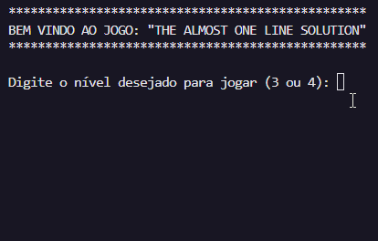
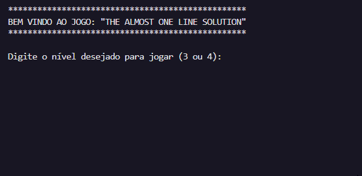
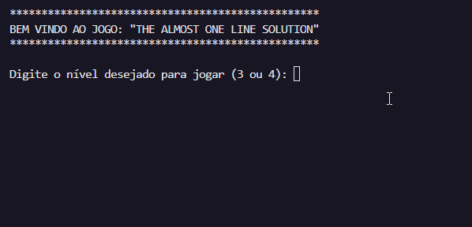

# Code Wars I | Projeto do Labirinto (Nível 4)  :robot:	

Bootcamp Python /código[s] 
Stone e How Bootcamps :green_heart: :purple_heart:	
 

#

### Nome do Projeto: "The Almost One Line Solution" 

<b>:rocket:	Grupo 30:</b>
<ul>
  <li><a href="https://github.com/igormndes" target="_blank">Igor Gabryell Mendes Melo</a></li>
  <li><a href="https://github.com/pedropst" target="_blank">Pedro Henrique Prestes Conceição</a></li>
  <li><a href="https://github.com/thaifurforo" target="_blank">Thainara Lessa Furforo</a></li>
  <li><a href="https://github.com/VitorMath" target="_blank">Vítor Mateus de Brito</a></li>
  <li><a href="https://github.com/YuriAoyamaSE" target="_blank">Yuri Aoyama da Costa</a></li>
</ul>
 

## :space_invader: Modos de jogo

### :round_pushpin:	Nível 3
Labirinto padrão utilizado, armazenado no arquivo "map.txt". 
Movimentação do robô pelo labirinto começa em um ponto selecionado pelo usuário.
 

 

### :round_pushpin:	Nível 4
Labirinto gerado de forma automática e aleatória. 
Duas opções para iniciar a movimentação do robô pelo labirinto: 
<ul>
<li>Opção 1: Usuário seleciona o ponto em que será iniciada a movimentação.</li>

<li>Opção 2: Ponto inicial da movimentação do robô é selecionado automaticamente de forma aleatória.</li>

</ul>

## :mag: Observações
<ul>
<li>O símbolo <b>#</b> representa as paredes do labirinto.</li>
<li>O símbolo <b>X</b> representa o robô em sua posição atual.</li>
<li>O espaço em branco representa os caminhos por onde o robô ainda não passou.</li>
<li>O símbolo <b>.</b> representa os caminhos por onde o robô já passou.</li>
<li>O símbolo <b>S</b> representa a saída do labirinto.</li>

</ul>
